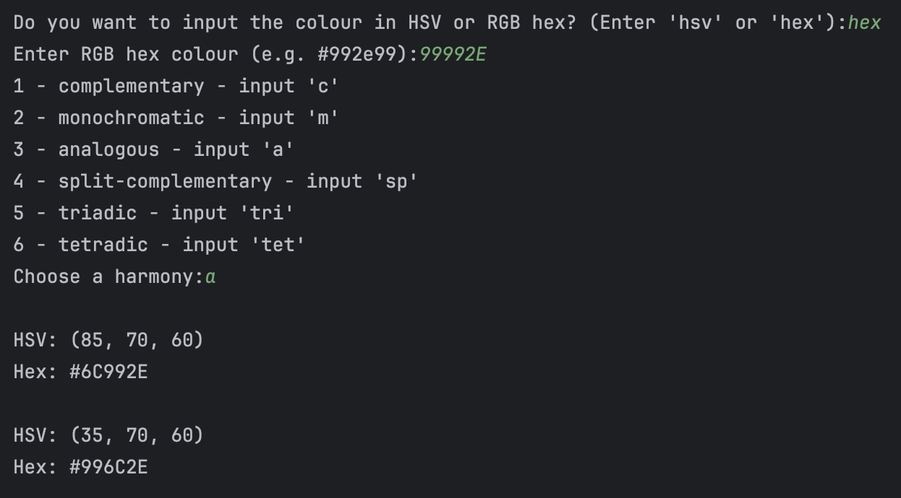

# Colour Coordination Tool

This C++ tool helps find colour harmonies based on either HSV (Hue, Saturation, Value) or RGB Hex values. 
Choose an input format, input a base colour, select a colour harmony type and receive a set of coordinated colours in both formats.

## Features

### Colour Harmony Types:
- Complementary: Finds the colour directly opposite on the colour wheel.
- Monochromatic: Generates variations of the same hue with different saturation and value. 
- Analogous: Provides colours adjacent to the base colour on the colour wheel. 
- Split Complementary: Returns the base colour and two colours adjacent to its complement. 
- Triadic: Outputs two colours evenly spaced around the colour wheel from the base colour. 
- Tetradic: Produces two pairs of complementary colours.

### Usage

#### Input Format:

- Choose an input format: either HSV or RGB Hex.
- 
#### Input Colour:

- Enter the value/values.

#### Select Harmony:

- Choose a colour harmony type from the options: Complementary, Monochromatic, Analogous, Split Complementary, Triadic or Tetradic.

#### Get Results:

- The tool will output the coordinated colours in HSV and RGB Hex format.

### Original Inspiration
This tool is inspired by the Sessions Colour Calculator. 
However, while the Sessions Colour Calculator provides a good approach, it operates differently from HSV values and their colour wheel placements. 
To address these differences and better align with the specific needs of HSV color calculations, I decided to build a custom solution.

### Example
