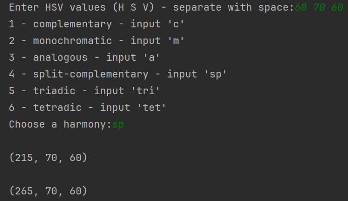

# Colour Coordination Tool

This C++ tool helps you find colour harmonies based on either HSV (Hue, Saturation, Value) values. Input a base colour, select a colour harmony type and receive a set of coordinated colours in HSV format.
Currently, I am working on extending this functionality to include an option for RGB Hex input and output in both HSV and RGB Hex format.

## Features

### Colour Harmony Types:
- Complementary: Finds the colour directly opposite on the colour wheel.
- Monochromatic: Generates variations of the same hue with different saturation and value. 
- Analogous: Provides colours adjacent to the base colour on the colour wheel. 
- Split Complementary: Returns the base colour and two colours adjacent to its complement. 
- Triadic: Outputs two colours evenly spaced around the colour wheel from the base colour. 
- Tetradic: Produces two pairs of complementary colours.

### Usage
#### Input Colour:

- Enter HSV so Hue (0-360), Saturation (0-100) and Value (0-100).

#### Select Harmony:

- Choose a colour harmony type from the options: Complementary, Monochromatic, Analogous, Split Complementary, Triadic or Tetradic.

#### Get Results:

- The tool will output the coordinated colours in HSV format.

### Development
- Extending this functionality to include an RGB Hex input option and output in both HSV and RGB Hex format. Hex output is working but hex input not yet.

### Original Inspiration
This tool is inspired by the Sessions Colour Calculator. 
However, while the Sessions Colour Calculator provides a good approach, it operates differently from HSV values and their colour wheel placements. 
To address these differences and better align with the specific needs of HSV color calculations, I decided to build a custom solution.

### Example

